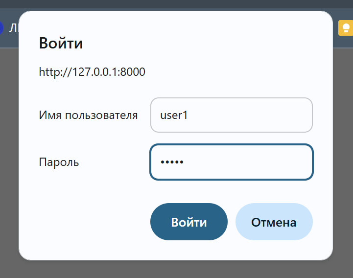

Тестирование 6.1
При переходе в http://127.0.0.1:8000/login возникает окошко. Если ввести корректные данные 
`user1` и `pass1`, то выйдет сообщение {"message":"You got my secret, welcome"}


При вводе неверных данных открывает окошко ещё раз
___

Тестирование 6.2

```curl -X POST -H "Content-Type: application/json" -d "{\"username\":\"user1\",\"password\":\"correctpass\"}" http://localhost:8000/register```

Результат: {"message":"User registered successfully"}


```curl -u user1:correctpass http://localhost:8000/login```

Результат: {"message":"Welcome, user1"}

```curl -u user1:wrongpass http://localhost:8000/login```

Результат: {"detail":"Invalid credentials"}
___
Тестирование 6.3

При MODE=DEV

```curl -u wrong_user:wrong_password http://localhost:8000/docs```
Результат: {"detail":"Unauthorized"}

```curl -i -u admin:secret http://localhost:8000/docs```
Результат: документация в формате html

При MODE=PROD

```curl http://localhost:8000/docs```
Результат: {"detail":"Not Found"}
___
Тестирование 6.4

Проверка на http://127.0.0.1:8000/docs

При попытке login с неверными данными выдаёт ```{
  "detail": "Invalid credentials"
}```

При попытке получить данные без токена выдаёт ```{
  "detail": "Not authenticated"
}```

При вводе верных данных возвращает токен. При авторизации и попытке получить защищённые данные возвращает ```{
  "message": "Access granted"
}```
___
Тестирование 6.5


